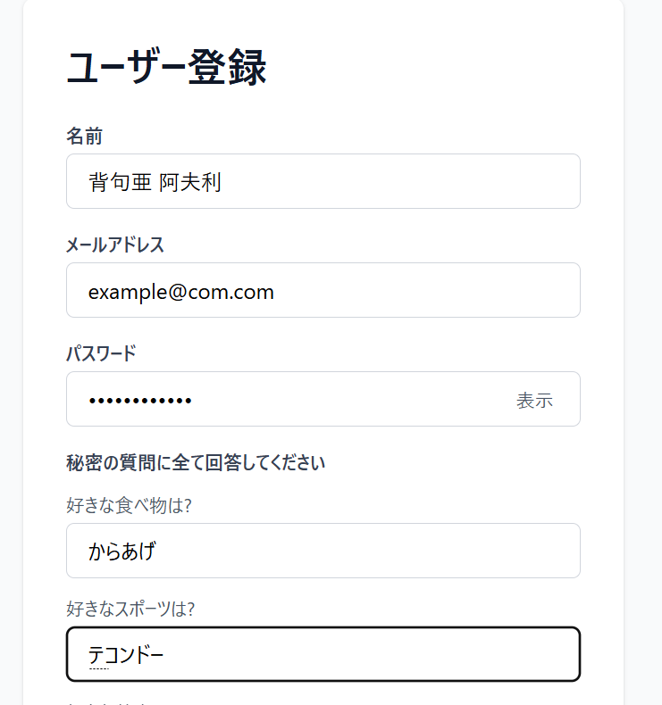
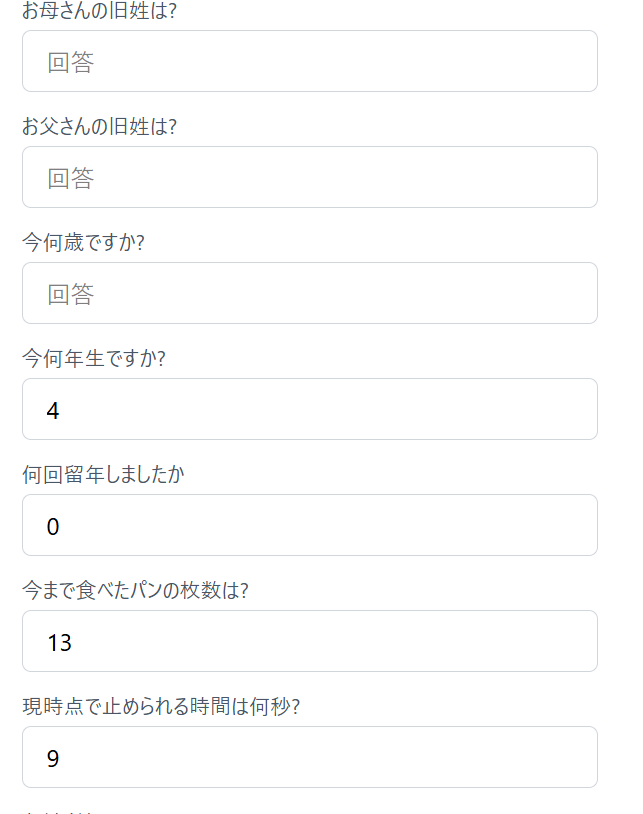
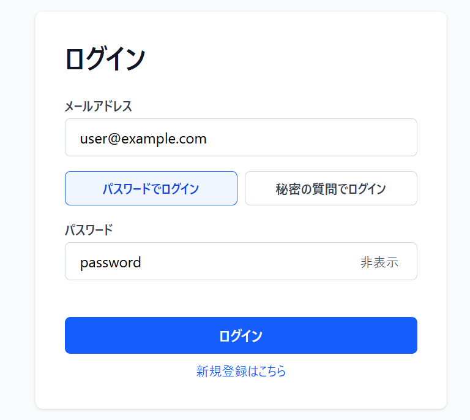
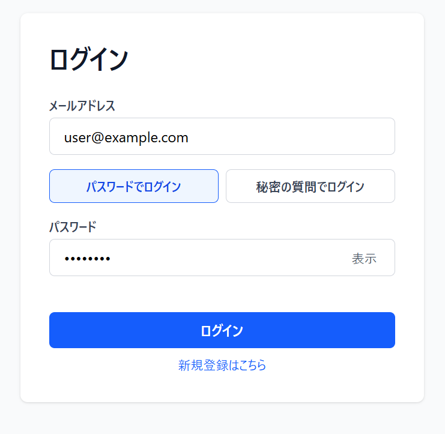
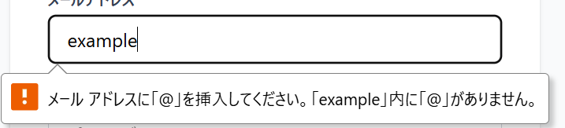

# セキュアなアプリ

セキュアなアプリはNext.jsで作ったセキュリティアプリです。 
公開先URL : https://my-sec-app.vercel.app/

## 主な機能

- メールアドレスとパスワードでのログイン
- 秘密の質問によるログイン 
- 以下に秘密の質問を登録する機能を示した画像を示します。 
   
      図1 秘密の質問機能(登録)
 
以下に秘密の質問に回答している様子を示した画像を示します。
 
  
      図2 秘密の質問機能(回答) 
       
       
  ・パスワードと秘密の質問の回答を bcryptjs でハッシュ化して保存
- JWTで認証トークンを発行し、アプリ内での認証状態の管理
- ログイン画面にパスワードの表示 / 非表示切り替え 
  以下にパスワードを表示機能を示した画像を示します。 
   
      図3 パスワード表示切替機能(表示)
 
以下にパスワード非表示機能を示した画像を示します。
 
  
      図4 パスワード表示切替機能(非表示) 
       
       
  ・メールアドレスの形式指定  
 以下の図1にメールアドレスの形式指定機能を示した画像を示します。 
  
   
      図5 メールアドレスの形式指定機能

## セキュリティ関する設計

- パスワードは平文で保存せず、bcryptjs でハッシュ化
- 秘密の質問の回答も同様にハッシュ化
- JWTは jose で発行し、期限付きのトークンとして使用
- ログインAPIは認証に失敗した場合に詳細を非表示
- セッション状態はクライアント側で保存しつつ、認証トークンの有効性を確認
- 秘密の質問は1問ではなく18問全て解答させることで誰も突破できな完璧な圧倒的セキュリティを実現しました

## 認証の流れ

1. ユーザー登録画面で名前・メールアドレス・パスワード・秘密の質問を入力
2. サーバー側でパスワードと回答をハッシュ化して保存
3. ログイン画面でパスワードまたは秘密の質問を使って認証
4. 認証に成功するとJWTトークンが返り、アプリ内でログイン状態を保持
5. 画面上部のヘッダーでログイン済みかどうかが表示

## 実装した場所

- src/lib/userStore.ts
  - ユーザー登録時に bcryptjs でハッシュを生成
  - パスワードの重複登録を防ぐチェックを導入
  - ユーザー情報は data/users.json に保存

- src/lib/auth.ts
  - JWTを jose で生成・検証
  - 12時間のトークン有効期限を設定

- src/app/api/login/route.ts
  - ログイン処理を行い、成功時にトークンとユーザー情報を返す

- src/app/api/register/route.ts
  - 登録処理を行い、必須項目が揃っているかチェック

- src/app/_contexts/SessionContext.tsx
  - セッション情報を保持し、ログアウト時に状態をクリア

